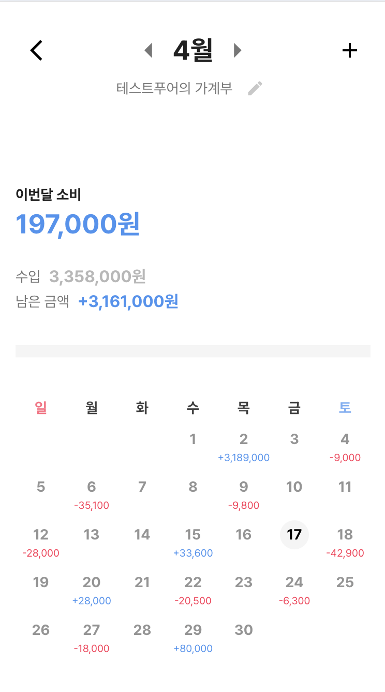
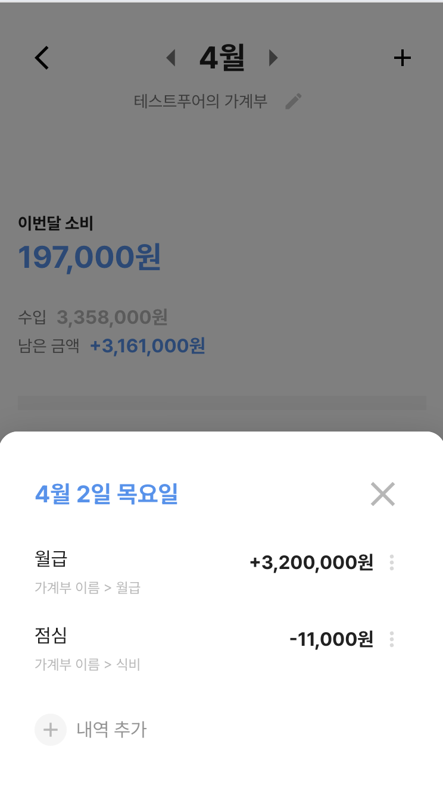
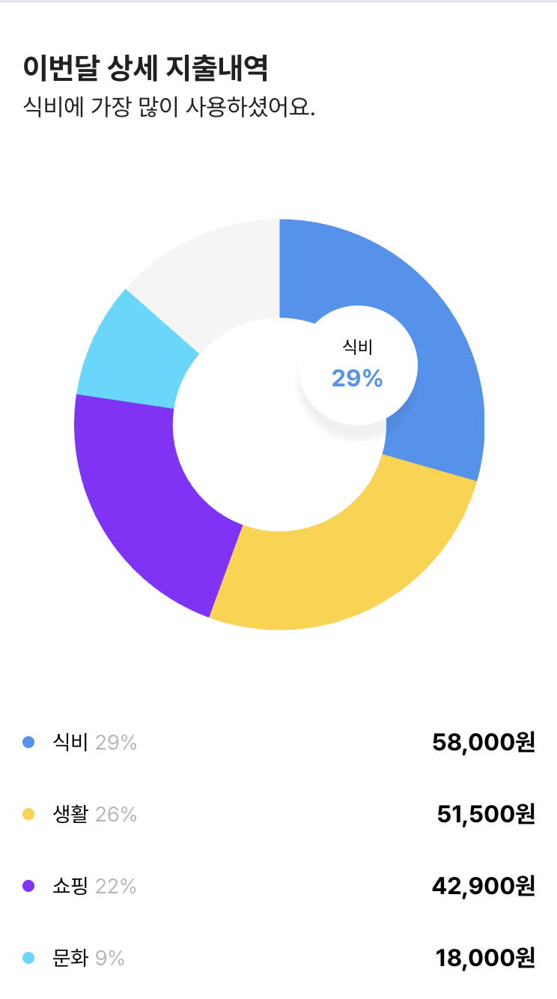
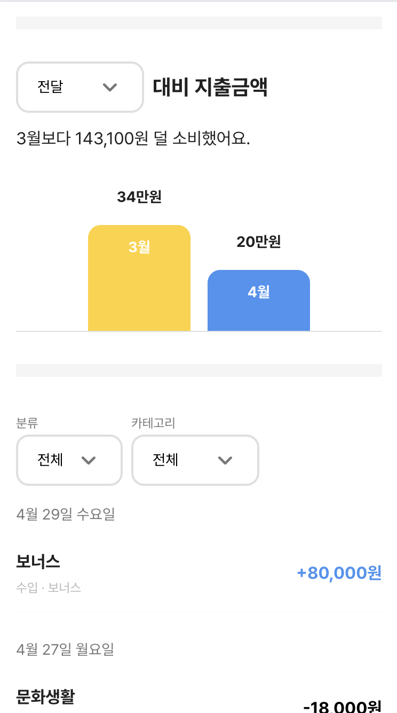
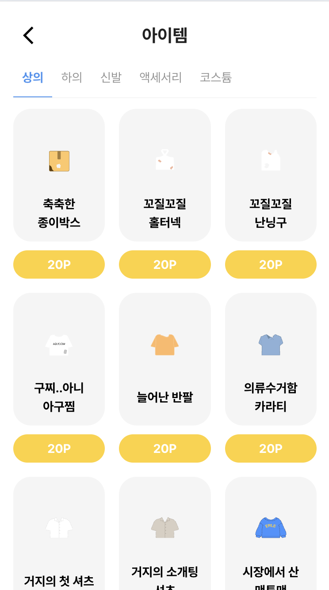
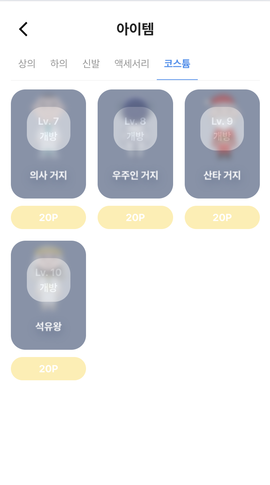

# 📱 apoorpoor-refactor

> 모바일 웹앱 기반 소비 관리 서비스

🔗 Live Demo: https://apoorpoor-refactor.vercel.app/

---

## 🗓️ 작업 기간
- 2026.03.27 ~

---

## 📌 프로젝트 소개

`apoorpoor-refactor`는 기존 React 기반 프로젝트를
**Next.js App Router 구조로 리팩토링**하며,
모바일 환경에 최적화된 소비 관리 웹앱으로 재구성하는 프로젝트입니다.

단순 UI 구현이 아닌,
**실제 서비스로 확장 가능한 구조와 데이터 흐름 설계**에 초점을 두고 있습니다.

---

## 🖼️ 화면 미리보기

### 메인
메인 대시보드에서 가계부와 푸어 키우기 화면으로 진입할 수 있습니다.


### 가계부
가계부 메인, 상세, 차트, 리스트 화면을 제공합니다.






### 푸어 키우기
현재 푸어 상태와 아이템 슬롯 화면에서 구매/착용 흐름을 테스트할 수 있습니다.





---

## 🛠 Tech Stack

| 영역 | 기술 |
|------|------|
| Frontend | Next.js 16 (App Router), React 19, TypeScript |
| Backend | Hono.js (Node.js) |
| Database | PostgreSQL 16, Prisma ORM |
| UI | MUI (Material UI), styled API, Design Token |
| Auth | JWT (jose), bcrypt, httpOnly Cookie |
| Infra | Docker Compose, pnpm Workspaces (Monorepo) |

---

## 📂 프로젝트 구조

```
apoorpoor-refactor/
├── apps/
│   ├── api/                    # Hono.js REST API (port 3001)
│   │   ├── src/
│   │   │   ├── lib/            # JWT 유틸리티
│   │   │   ├── middleware/     # 인증 미들웨어
│   │   │   ├── routes/         # API 라우트 (auth, ledger, poor)
│   │   │   └── services/       # 비즈니스 로직
│   │   └── .env.local
│   └── web/                    # Next.js 프론트엔드 (port 3000)
│       ├── src/
│       │   ├── app/            # App Router 페이지
│       │   │   ├── sign-in/    # 로그인
│       │   │   ├── sign-up/    # 회원가입
│       │   │   ├── main/       # 메인 대시보드
│       │   │   ├── ledger/     # 가계부
│       │   │   ├── poor/       # 푸어 키우기
│       │   │   └── user-info/  # 내 정보
│       │   ├── features/       # 도메인별 로직
│       │   │   ├── auth/       # 인증 Server Actions
│       │   │   ├── ledger/     # 가계부 Actions, 상수, 유틸
│       │   │   └── poor/       # 푸어 구매/착용 Actions
│       │   ├── shared/         # 공용 모듈
│       │   │   ├── ui/         # 공용 UI 컴포넌트
│       │   │   └── lib/        # fetchApi 등 유틸리티
│       │   ├── styles/         # 디자인 토큰, 테마
│       │   └── middleware.ts   # 라우트 보호
│       └── .env.local
├── packages/
│   ├── db/                     # Prisma 스키마, 마이그레이션, 시드
│   └── shared/                 # 공용 TypeScript 타입
├── docker-compose.yml
└── package.json
```

---

## ✨ 주요 기능

### 🔐 인증
- JWT 기반 인증 (httpOnly Cookie)
- 회원가입 / 로그인 / 로그아웃
- 비밀번호 해싱 (bcrypt)
- 비밀번호 변경
- 아이디 저장 (localStorage)
- Next.js Middleware 라우트 보호

### 📒 가계부
- 월별 가계부 조회 (캘린더, 파이차트, 바차트, 내역 리스트)
- 내역 추가 / 수정 / 삭제 (Server Actions + revalidatePath)
- 캘린더 날짜 클릭 시 일별 내역 Drawer 표시
- 내역 리스트 클릭 시 동일한 Drawer 표시
- 내역 필터링 (수입/지출, 카테고리)
- 날짜 선택 (Calendar Date Picker with 월 이동)
- 내역 추가 시 포인트 적립 (10pt)
- 가계부 이름 수정
- 데이터 없는 달의 Empty UI (차트, 리스트)

### 🧍 푸어 키우기
- `/poor`에서 현재 레벨, 포인트, 착용 중 아이템 조회
- 아이템 카테고리별 목록 조회 (상의 / 하의 / 신발 / 액세서리 / 코스튬)
- 아이템 상태 표시 (구매 가능 / 보유 / 착용 중 / 잠금)
- 아이템 구매 Drawer 및 구매 후 포인트 차감
- 아이템 착용 / 해제
- 같은 카테고리의 기존 착용 아이템 자동 해제 후 새 아이템 착용
- `/poor`에서 착용 중인 아이템 오버레이 렌더
- 테스트 시드 계정에 레벨 5, 기본 포인트, 보유/착용 아이템 제공

### 🧩 공용 컴포넌트
- Calendar (readOnly / date picker / 금액 표시 모드)
- Drawer (모바일 앱 영역 내 bottom sheet)
- Dropdown (maxHeight 50dvh 스크롤)
- TextField (비밀번호 show/hide 토글)
- Button, Radio, Snackbar (useSnackbar hook)

---

## 🚀 실행 방법

### 📋 사전 요구사항
- Node.js 20+
- pnpm
- Docker

### 1. 의존성 설치
```bash
pnpm install
```

### 2. 환경변수 설정
```bash
cp packages/db/.env.example packages/db/.env
cp apps/web/.env.example apps/web/.env.local
cp apps/api/.env.example apps/api/.env.local
```

### 3. DB 셋업
Docker로 PostgreSQL을 실행하고, 마이그레이션 및 시드 데이터를 적용합니다.
```bash
pnpm db:setup
```
> `docker compose up -d` → `prisma migrate deploy` → `prisma db seed`를 순서대로 실행합니다.
> 처음 세팅하거나 DB를 초기화(`docker compose down -v`)한 경우에만 실행하면 됩니다.

스키마 변경 시 개발용 마이그레이션은 아래 명령으로 생성할 수 있습니다.
```bash
pnpm db:migrate:dev
```

### 4. 개발 서버 실행
```bash
pnpm dev
```
- Web: http://localhost:3000
- API: http://localhost:3001

---

## 🧪 테스트 계정

시드 데이터와 함께 생성되는 테스트 계정입니다.

| 항목 | 값 |
|------|------|
| 이메일 | `test@example.com` |
| 비밀번호 | `test1234` |
| 기본 레벨 | `5` |
| 기본 포인트 | `150P` |

> `pnpm db:setup` 실행 시 자동 생성됩니다. 2026년 1~4월 가계부 데이터(71건), 푸어 아이템 51종, 기본 보유 아이템 5개가 함께 시드됩니다.

---

## 📡 API 엔드포인트

### Auth (Public)
| Method | Path | 설명 |
|--------|------|------|
| POST | `/auth/signup` | 회원가입 |
| POST | `/auth/signin` | 로그인 |
| POST | `/auth/signout` | 로그아웃 |
| GET | `/auth/me` | 현재 유저 정보 |
| PATCH | `/auth/password` | 비밀번호 변경 |

### Ledger (인증 필요)
| Method | Path | 설명 |
|--------|------|------|
| GET | `/ledger/settings` | 가계부 설정 조회 |
| PATCH | `/ledger/settings` | 가계부 이름 수정 |
| GET | `/ledger/dashboard` | 월별 대시보드 |
| GET | `/ledger/transactions` | 월별 내역 목록 |
| GET | `/ledger/items/:id` | 내역 단건 조회 |
| POST | `/ledger/items` | 내역 추가 (+10pt) |
| PATCH | `/ledger/items/:id` | 내역 수정 |
| DELETE | `/ledger/items/:id` | 내역 삭제 |

### Poor (인증 필요)
| Method | Path | 설명 |
|--------|------|------|
| GET | `/poor` | 푸어 상태, 전체/보유/착용/구매 가능 아이템 조회 |
| POST | `/poor/items/:id/purchase` | 아이템 구매 |
| PATCH | `/poor/items/:id/equip` | 아이템 착용 / 해제 |

---

## 🚧 진행 상태

- [x] 모노레포 구조 설계 (pnpm workspaces)
- [x] 공용 UI 컴포넌트 구축
- [x] 모바일 레이아웃 설계 (430px)
- [x] PostgreSQL + Prisma ORM 연동
- [x] REST API 설계 및 구현 (Hono.js)
- [x] 가계부 CRUD 기능
- [x] JWT 인증 시스템 (회원가입/로그인/로그아웃)
- [x] 비밀번호 변경 기능
- [x] 캘린더, 파이차트, 바차트 데이터 시각화
- [x] 포인트 시스템
- [x] 푸어 키우기 기능
- [ ] 소비 챌린지 기능
- [ ] 실제 서비스 배포 및 운영

---

## 💡 목표

단순한 UI 구현을 넘어,
**실제 서비스로 확장 가능한 구조와 설계를 갖춘 풀스택 프로젝트**를 만드는 것을 목표로 합니다.
